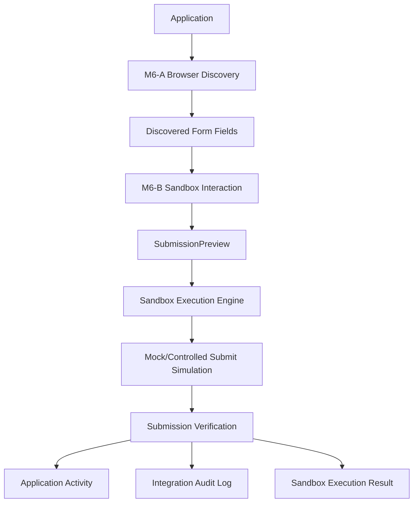

# Phase 6 M6-C — Controlled Sandbox Execution & Submission Verification

## 1. Objective

Build the next layer on top of M6-A and M6-B:

- M6-A = browser session + read-only form discovery
- M6-B = sandbox form interaction + field verification
- M6-C = controlled sandbox execution + submission verification

M6-C must remain completely isolated from real external application submission.

The goal is to prove the complete browser workflow:

Discovery
→ Field Mapping
→ Sandbox Interaction
→ Verification
→ Simulated Submission
→ Result Recording
→ Audit

No real external ATS submission is allowed in M6-C.

---

## 2. Mandatory Safety Rules

### M6-C MUST NOT:

- Submit an application to a real ATS.
- Click a real Apply/Submit button.
- Send email.
- Send LinkedIn messages.
- Upload candidate files to a real external provider.
- Modify candidate profile data.
- Enable AUTO_APPLY.
- Enable ALLOW_LIVE_SUBMISSION.
- Bypass the existing approval state machine.

### Required configuration

```text
AUTO_APPLY=false
AUTO_SEND_EMAIL=false
AUTO_LINKEDIN=false
ALLOW_LIVE_SUBMISSION=false
````

Execution mode:

```text
SANDBOX
```

---

# 3. M6-C Architecture



---

# 4. Sandbox Execution Engine

Create:

```text
SandboxExecutionService
SandboxExecutionServiceImpl
```

Responsibilities:

1. Validate application ownership.
2. Validate application state.
3. Validate M6-A discovery result.
4. Validate M6-B interaction result.
5. Validate all required fields.
6. Verify no unresolved dangerous fields are being executed.
7. Verify execution mode is SANDBOX.
8. Acquire distributed execution lock.
9. Execute against a controlled/mock browser provider.
10. Simulate submission.
11. Verify simulated submission result.
12. Persist execution result.
13. Persist audit event.
14. Release lock.

---

# 5. Sandbox Provider

Create a dedicated provider:

```text
SandboxApplicationExecutionProvider
```

This provider MUST NOT connect to:

* Greenhouse production
* Lever production
* Indeed
* LinkedIn
* Any real ATS

It should operate against:

```text
localhost
```

or an isolated mock HTML form.

Example:

```text
http://localhost:<sandbox-port>/mock/application
```

The provider should simulate:

```text
FORM_LOADED
FIELDS_FILLED
VALIDATION_PASSED
SUBMISSION_SIMULATED
SUBMISSION_VERIFIED
```

---

# 6. Execution State

Introduce a dedicated sandbox execution status.

Suggested states:

```text
NOT_STARTED
DISCOVERY_READY
INTERACTION_READY
READY_FOR_SANDBOX
EXECUTING
SUBMISSION_SIMULATED
VERIFIED
FAILED
ACTION_REQUIRED
```

Do NOT use:

```text
APPLIED
```

for a sandbox execution.

A sandbox run must never look like a real external application.

---

# 7. Sandbox Execution Result

Create:

```text
SandboxExecutionResult
```

Suggested structure:

```json
{
  "applicationId": 123,
  "executionMode": "SANDBOX",
  "status": "VERIFIED",
  "fieldsDetected": 18,
  "fieldsMapped": 16,
  "fieldsVerified": 16,
  "fieldsRequireReview": 2,
  "submissionSimulated": true,
  "submissionVerified": true,
  "realSubmissionAttempted": false,
  "emailSent": false,
  "fileUploadedToRealProvider": false
}
```

The following values MUST always remain:

```text
realSubmissionAttempted = false
emailSent = false
fileUploadedToRealProvider = false
```

---

# 8. Submission Verification

Create:

```text
SandboxSubmissionVerificationService
```

It should verify:

1. Correct sandbox target.
2. Correct application ID.
3. Expected form loaded.
4. Required fields populated.
5. Field values persisted after input.
6. No unresolved required fields.
7. Submit control was identified.
8. Submit action was simulated only.
9. Expected sandbox response received.
10. No real external network submission occurred.
11. Audit event was recorded.

Return:

```text
VERIFIED
```

only when all checks pass.

---

# 9. No Real Submit Button Click

M6-C must NOT execute:

```java
submitButton.click();
```

against an external provider.

For the sandbox provider, a controlled simulation may use a local/mock submit endpoint.

Example:

```text
POST /mock/sandbox/applications
```

This endpoint must exist only for sandbox testing.

---

# 10. Distributed Lock

Reuse:

```text
DistributedExecutionLock
```

Lock key:

```text
application-browser-sandbox:{applicationId}
```

The lock must:

* prevent concurrent execution
* expire safely
* always release in finally
* prevent duplicate sandbox runs

---

# 11. Audit Events

Record:

```text
SandboxBrowserExecutionStartedEvent
SandboxFormInteractionCompletedEvent
SandboxSubmissionSimulatedEvent
SandboxSubmissionVerifiedEvent
SandboxBrowserExecutionFailedEvent
```

Audit records must contain:

* application ID
* execution mode
* provider
* action
* status
* duration
* sanitized metadata

Never record:

* passwords
* API keys
* bearer tokens
* session cookies
* raw authentication headers

---

# 12. Database

Add a Flyway migration if persistence is required.

Suggested:

```text
V20__create_sandbox_execution_schema.sql
```

Suggested table:

```sql
CREATE TABLE sandbox_execution_runs (
    id BIGINT AUTO_INCREMENT PRIMARY KEY,
    application_id BIGINT NOT NULL,
    user_id BIGINT NOT NULL,
    execution_mode VARCHAR(30) NOT NULL,
    status VARCHAR(40) NOT NULL,
    fields_detected INT NOT NULL DEFAULT 0,
    fields_mapped INT NOT NULL DEFAULT 0,
    fields_verified INT NOT NULL DEFAULT 0,
    fields_require_review INT NOT NULL DEFAULT 0,
    submission_simulated BOOLEAN NOT NULL DEFAULT FALSE,
    submission_verified BOOLEAN NOT NULL DEFAULT FALSE,
    real_submission_attempted BOOLEAN NOT NULL DEFAULT FALSE,
    started_at DATETIME NOT NULL,
    completed_at DATETIME NULL,
    error_code VARCHAR(80) NULL,
    created_at DATETIME NOT NULL DEFAULT CURRENT_TIMESTAMP,

    CONSTRAINT fk_sandbox_application
        FOREIGN KEY (application_id)
        REFERENCES applications(id)
        ON DELETE CASCADE,

    CONSTRAINT fk_sandbox_user
        FOREIGN KEY (user_id)
        REFERENCES users(id)
        ON DELETE CASCADE
);
```

---

# 13. REST API

Add:

```http
POST /api/v1/applications/{id}/browser/sandbox/execute
```

Purpose:

Execute the complete M6-A → M6-B sandbox workflow.

Response:

```json
{
  "applicationId": 123,
  "executionMode": "SANDBOX",
  "status": "VERIFIED",
  "submissionSimulated": true,
  "submissionVerified": true,
  "realSubmissionAttempted": false
}
```

Also add:

```http
GET /api/v1/applications/{id}/browser/sandbox/status
```

Returns the latest sandbox execution status.

---

# 14. Frontend

Add a sandbox execution action to the application workspace.

Button:

```text
Run Sandbox Application
```

Before execution display:

```text
SANDBOX MODE

This will:
✓ Discover the form
✓ Map candidate fields
✓ Fill the sandbox form
✓ Verify field values
✓ Simulate submission

It will NOT:
✗ Submit a real application
✗ Send email
✗ Upload files to a real provider
```

After execution display:

```text
Sandbox Result

Status: VERIFIED

Fields detected: 18
Fields mapped: 16
Fields verified: 16
Needs review: 2

Submission: SIMULATED
Real submission: NO
Email sent: NO
```

---

# 15. API Safety Checks

Before sandbox execution:

```text
1. Authenticated user
2. Application belongs to user
3. Application exists
4. Execution mode == SANDBOX
5. AUTO_APPLY == false
6. ALLOW_LIVE_SUBMISSION == false
7. Discovery result exists
8. Interaction result exists
9. No unresolved executable required fields
10. Distributed lock acquired
```

If any check fails:

```text
ACTION_REQUIRED
```

or:

```text
FAILED
```

Never continue execution.

---

# 16. Failure Handling

If sandbox execution fails:

```text
EXECUTING
    ↓
FAILED
```

Persist:

* failure reason
* error code
* execution duration
* audit event

Never convert a failure into:

```text
APPLIED
```

Never silently retry indefinitely.

---

# 17. Tests

Required tests:

### SandboxExecutionServiceTest

Test:

* successful execution
* missing discovery
* missing interaction
* unresolved required field
* application ownership
* safety flag enforcement
* distributed lock
* successful verification
* failed verification

### SandboxSubmissionVerificationServiceTest

Test:

* all checks pass
* missing field
* incorrect target
* submission simulation missing
* audit missing
* verification failure

### SandboxApplicationExecutionProviderTest

Test:

* sandbox provider only
* no external provider connection
* simulated submission
* result verification
* failure handling

### Integration Test

Test complete workflow:

```text
Application
→ Discovery
→ Interaction
→ Sandbox Execution
→ Simulated Submission
→ Verification
→ Audit
```

---

# 18. Regression Requirement

Run:

```bash
./gradlew test
```

Expected:

```text
BUILD SUCCESSFUL
```

All previous tests must remain green.

M6-C must not break:

* Phase 1
* Phase 2
* Phase 3
* Phase 4
* Phase 5
* M6-A
* M6-B

---

# 19. Frontend Build

Run:

```bash
npm run build
```

Expected:

```text
0 TypeScript errors
0 compilation errors
```

---

# 20. Browser Verification

Use the local application:

```text
http://localhost:5173
```

Verify:

1. Login.
2. Open an application.
3. Open browser workspace.
4. Start sandbox execution.
5. Verify discovery.
6. Verify interaction.
7. Verify sandbox execution.
8. Verify simulated submission.
9. Verify final status.
10. Verify audit history.

The browser verification MUST prove:

```text
Real external submission = NO
Email sent = NO
Real file upload = NO
```

---

# 21. Git Commit

After all tests pass:

```bash
git status
git add .
git commit -m "feat(phase6-m6-c): implement controlled sandbox execution and verification"
git push origin main
```

---

# 22. Mandatory Stop Gate

When M6-C is complete:

STOP.

Do NOT automatically start:

* M6-D
* live ATS execution
* real application submission
* real file upload
* automatic apply

Report:

```text
Phase 6 M6-C COMPLETE

Tests: PASS
Frontend Build: PASS
Browser Verification: PASS

Real submission: NO
Email sent: NO
Real file upload: NO
AUTO_APPLY: OFF
ALLOW_LIVE_SUBMISSION: OFF

Commit: <hash>

STOP GATE ACTIVE
```

Wait for explicit approval before proceeding.

````

### Where you are now

```text
Phase 1  ✅
Phase 2  ✅
Phase 3  ✅
Phase 4  ✅
Phase 5  ✅
           M1 ✅
           M2 ✅
           M3 ✅
           M4-A ✅
           M4-B ✅
           M4-C ✅
           M4-D ✅
           M4-E ✅

Phase 6
  M6-A ✅
  M6-B ✅
  M6-C ⏭️ NEXT
````
