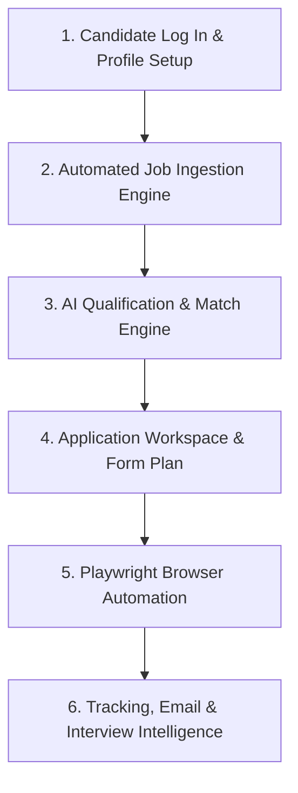

Here is a detailed explanation of how **AI Career OS** works in real production, how real data flows through the backend system, and what a candidate can do from the moment they log in.

---

### 🏗️ How Production Data Flows in AI Career OS

In a real production deployment, data is **not hardcoded**. The system works as an autonomous pipeline across **6 core engines** built in Phases 1–4:



---

### 1️⃣ Step 1: Candidate Sign-In & Profile Setup (Phase 1)
When a real candidate signs up or logs into **AI Career OS**:
- **Authentication**: JWT token is issued via `/api/v1/auth/login`.
- **Profile & Resume Facts**: The candidate creates their profile (skills, work history, target roles, preferred locations, and uploaded master resume).
- **Database Entity**: Stored in MySQL under [`Profile`](file:///d:/mks/ai-career-os/src/main/java/com/ai/career/domain/entity/Profile.java) (`profiles` table).

---

### 2️⃣ Step 2: Job Ingestion & Discovery Engine (Phase 1 & 2)
When the user opens **Job Discovery** or when background cron jobs trigger:
- **Fetch API / Connectors**: The backend invokes [`JobIngestionService`](file:///d:/mks/ai-career-os/src/main/java/com/ai/career/job/service/JobIngestionService.java).
- **External Providers**: The system queries external job boards (LinkedIn, Indeed, Jooble, Greenhouse, Lever, etc.) or webhook ingestion pipelines.
- **Normalization**: Raw postings are sanitized and stored in the database under `jobs` table (`Job` entity).

---

### 3️⃣ Step 3: AI Qualification & Match Engine (Phase 1 & 2)
As soon as new jobs are ingested:
- **Vector / Ollama AI Scoring**: [`MatchScoringService`](file:///d:/mks/ai-career-os/src/main/java/com/ai/career/match/service/impl/MatchScoringServiceImpl.java) compares the candidate’s profile against job requirements.
- **Match Score Calculation**: Generates a fit score (e.g. `94% Match`) and stores fit reasoning in `job_matches` table.
- **Production API**: `GET /api/v1/jobs` returns the candidate’s real matched jobs directly from `job_matches`!

---

### 4️⃣ Step 4: Application Workspace & Readiness Check (Phase 2 & 3A)
When the candidate clicks **"Create Application"** on a job listing:
- **Workspace Provisioning**: Creates an [`Application`](file:///d:/mks/ai-career-os/src/main/java/com/ai/career/application/domain/entity/Application.java) record (`applications` table) in state `DISCOVERED` or `READY_FOR_REVIEW`.
- **AI Tailoring**: The AI automatically generates a candidate-grounded tailored resume PDF and personalized cover letter.
- **Form Discovery & Mapping**: Discovers application form fields (e.g., Workday, Lever, Greenhouse inputs) and creates a form execution plan.
- **Human Approval**: Because safety locks (`AUTO_APPLY = OFF`) are active by default, the candidate reviews the application workspace and clicks **"Approve & Prepare"**.

---

### 5️⃣ Step 5: Autonomous Browser Execution Engine (Phase 3B)
Once approved by the candidate:
- **Execution Request**: Calling `POST /api/v1/applications/{id}/execute` triggers [`ApplicationOrchestratorService`](file:///d:/mks/ai-career-os/src/main/java/com/ai/career/execution/service/impl/ApplicationOrchestratorServiceImpl.java).
- **Playwright Automation**: A headless browser instance launches on the server, navigates to the job portal, fills candidate facts into the form fields, uploads the tailored resume, and executes the submission safely.
- **State Transition**: State updates to `APPLIED`.

---

### 6️⃣ Step 6: Tracking, Email & Interview Intelligence (Phase 4)
After submission, Phase 4 engines take over autonomously:
- **Tracking Engine (M1)**: Logs activity timeline and calculates next action recommendations via [`NextActionEngine`](file:///d:/mks/ai-career-os/src/main/java/com/ai/career/tracking/service/impl/NextActionEngine.java).
- **Email Intelligence (M2)**: Recruiter emails are ingested via [`EmailIngestionPipelineService`](file:///d:/mks/ai-career-os/src/main/java/com/ai/career/tracking/email/service/impl/EmailIngestionPipelineServiceImpl.java). AI classifies incoming emails (`INTERVIEW_INVITATION`, `REJECTION`, `APPLICATION_CONFIRMATION`), extracts Zoom/Teams meeting URLs, and matches them to the application.
- **Follow-up Automation (M3)**: Automatically schedules multi-step follow-up check-ins (+3 days post-submission, +5 days post-#1 check-in).
- **Interview Workspace (M4)**: Auto-provisions an interview prep kit (Company Overview, Role Focus, Candidate Talking Points, Questions to Ask) and provides interactive AI Mock Practice with numerical scoring (0–100) and feedback.

---

### 💡 Why `defaultJobs` Exists in `api.ts`

```typescript
// In frontend/src/services/api.ts
export const jobsApi = {
  getJobs: async () => {
    await ensureAuthenticated();
    try {
      const res = await apiClient.get('/jobs');
      const list = Array.isArray(res.data) ? res.data : (res.data?.data || []);
      if (list && list.length > 0) return list; // <--- Live DB production data!
    } catch {
      // Fallback
    }
    return defaultJobs; // <--- Fallback ONLY if local DB has 0 ingested jobs
  }
};
```

1. **Production Mode (Live DB Has Data):**
   - When the backend has ingested real job postings and computed matches, `apiClient.get('/jobs')` returns real data from MySQL.
   - `list.length > 0` is `true`, so `getJobs()` returns **100% live production data** from your database!

2. **Fresh Development / Initial Demo Mode:**
   - If a developer or candidate opens the web app on a brand new database before triggering job ingestion, `list.length` is `0`.
   - The fallback array `defaultJobs` ensures that the user interface never looks empty or broken, giving them immediate opportunities to inspect and interact with the application workspace features.

---

### 🎯 What a Candidate Can Do in Production

When a real candidate opens the dashboard:
1. **View Real Opportunities**: Browse ingested jobs sorted by fit score on **Job Discovery**.
2. **Review & Approve**: Open the **Application Workspace** to inspect generated resumes, check form mapping, and click **"Approve & Prepare"**.
3. **Execute Submissions**: Click **"Execute Submission"** to let the system's Playwright engine apply automatically.
4. **Monitor Responses**: View classified recruiter emails, extracted interview links, and automated follow-ups.
5. **Practice Interviews**: Open **Interview Prep** to study company overview talking points and practice mock interview questions with AI scoring.