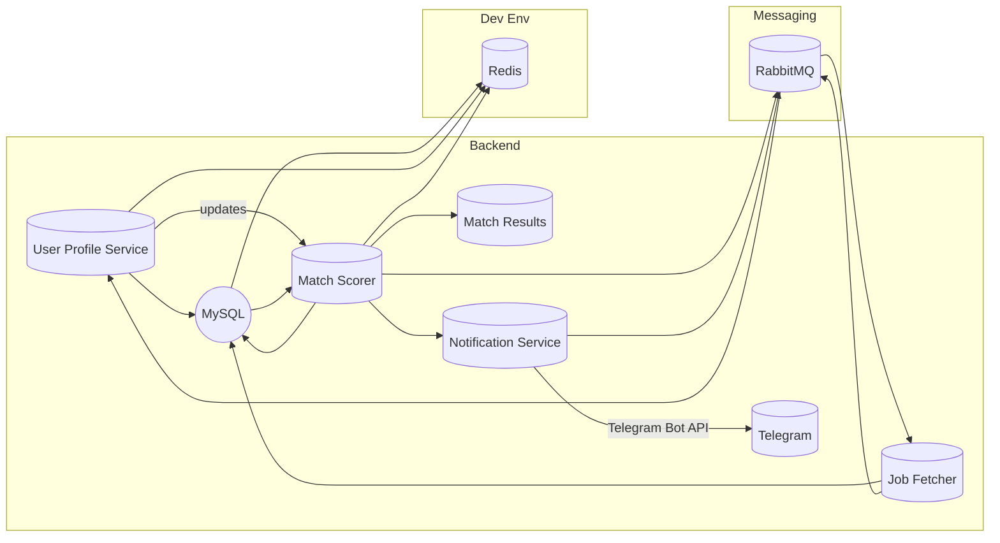
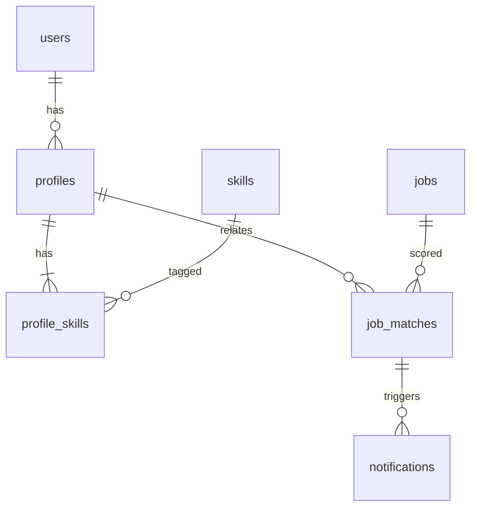

# Phase 1 PRD – AI Career OS (Java/Spring)

**Executive Summary:** We propose an **AI Career Operating System** that automates job discovery and application preparation for the user. In Phase 1 (MVP), the system will provide user authentication, career profile management, job fetching & matching, resume generation stubs, and notifications. It will be a modular Spring Boot application (Java 21) using MySQL 8 (GPL open-source RDBMS), Redis, RabbitMQ, Docker Compose, and local LLM support (Ollama). The focus is on a robust, production-ready backend and clear APIs/UI. Future phases will add full AI tailoring, cover letters, auto-apply, and learning loops.  

**Vision & Goals:** Empower job seekers with an always-on AI assistant. Key goals: *maximize relevant applications*, *minimize manual effort*, *maintain high quality/personalization*. We’ll ensure security (stateless JWT auth), scalability (microservices-ready Spring Boot), and privacy compliance. Phase 1 delivers the foundation so user growth is seamless.

**Target Users/Personas:**  
- **Software Engineer (“Satish”)** – mid-career dev seeking new roles. Wants to apply widely but smartly. Tech-savvy, uses tools.  
- **Career Coaches** – manage multiple profiles. Use system to find jobs for clients.  
- **Recruiter-Prospectors** – vet candidates’ profiles against job posts (future feature).

**Success Metrics:** Number of matched jobs per user, profile completion rate, system uptime, REST API error rate, response time (<200ms typical), daily active users. (Phase 1: functional correctness and stability; Phase 2: candidate interview rate; Phase 3: interview conversion).

## User Journeys

- **Sign up & set up:** User registers, confirms email, completes a career profile (skills, experience, resume upload).  
- **Job Matching:** System fetches jobs periodically (e.g. every hour) from APIs and scrapers, deduplicates, scores match, and notifies user of high-match jobs.  
- **Profile Update:** User refines profile; system updates match scores.  
- **Notification:** User receives Telegram alerts for new jobs and status changes.  
- **Review & Next Steps:** (Future phases: user reviews resume drafts, approves sending email or auto-apply.)

## Functional Requirements

- **Authentication & Security:** Email/password login, JWT issuance, password hashing, role-based access (basic user/admin). Stateless auth (no sessions) for scalability.  
- **Career Profile:** CRUD endpoints (REST) for user profile, including personal details, skills list, experiences, education, and uploaded base resume (PDF). Validate required fields (e.g. name, email) and data types. Profile stored in MySQL (normalized schema).  
- **Resume Management:** Store uploaded resume PDFs in MinIO (S3-compatible). Provide an endpoint to download. (*AI resume tailoring is Phase 2, but stub generation endpoint returns original resume*.)  
- **Job Discovery:** Connectors to job sources (REST APIs or scrapers). For Phase 1, implement **Jooble API** (JSON jobs) and an Apify/HTTP scraper for GitHub Jobs or similar. Fetch job data (title, company, location, description, URL) and store in DB. Use environment-configured API keys.  
- **Job Deduplication:** Remove duplicates by unique job IDs or hash (Jooble provides `id`). If no ID, dedupe by `(title, company, location)`.  
- **Match Scoring Service:** Simple algorithm: compare user skills vs job requirements (keyword overlap). Compute a score (0–100). (Phase 1: use term frequency; Phase 2: use embeddings+Chroma.)  
- **Notifications:** Send Telegram messages to user for new high-match jobs or system alerts. Use a bot token (configurable).  
- **Admin/UI:** Minimal admin UI for dashboard and profile; also REST APIs for future UI. Use JWT on API calls.  
- **Logging/Audit:** Log all actions (profile updates, job fetches) to DB or Elasticsearch. Audit log for security.  
- **Configuration:** Use application.properties or YAML for secrets (DB password, API keys). Support config via env vars (12-factor).  
- **CI/CD & Testing:** Set up GitHub Actions or similar. Write JUnit tests with Testcontainers (MySQL, Redis, RabbitMQ). Automate builds and Docker image pushes.  
- **Containerization:** Docker Compose file to launch MySQL, Redis, RabbitMQ, Qdrant/Chroma (vector DB, for Phase 2), MinIO, and the app. Use official images. Ensure idempotent (Flyway on startup).

## Non-Functional Requirements

- **Scalability:** Stateless services. MySQL and Redis scale out. Spring Boot auto-configures embedded Tomcat.  
- **Performance:** API <200ms for typical calls. Use Redis caching for frequent reads (profile, config).  
- **Reliability:** Use health checks (Spring Boot Actuator) and metrics. MySQL is reliable and can cluster. “MySQL…very fast, reliable, scalable”. Redis (BSD license) for caching. RabbitMQ for decoupling (Spring AMQP supports it easily).  
- **Security:** Passwords hashed (bcrypt). JWT signed with secret. HTTPS required in prod. Use OWASP recommendations.  
- **Maintainability:** Modular Monolith with clear packages: e.g. `auth`, `user`, `profile`, `job`, `notification`, `config`, `common`. Later split by domain.  
- **Compliance:** GDPR: allow user data deletion, encryption at rest for sensitive info. CAN-SPAM: opt-out link if emailing (future).  
- **Localization:** Only English UI for now. Support Asia time zones.

## Assumptions & Constraints

- **Stack:** Java 21, Spring Boot 3+, MySQL 8, Redis, RabbitMQ, Playwright, Ollama, Qdrant/Chroma, MinIO. (All open-source.)  
- **Budget:** No new paid services; rely on OSS and free tiers.  
- **Data:** Limited to tech jobs; no scraped personal data of users.  
- **Ops:** Devs have Docker and basic infra.  
- **AI:** Phase 1 only uses AI stubs. Ollama will be installed locally for future.  
- **Terms of Use:** Use only open APIs and allowable scraping (per terms). E.g., GitHub Jobs API is deprecated; use a board with open access or Apify scrapers.

**Out of Scope (Phase 1):** Actual email outreach, applying to jobs, interview scheduling, cover-letter generation, advanced ML. Focus is on core data pipeline and UI.

## System Architecture



- **CareerProfile Service:** Manages user data. Package: `com.ai.career.profile`. Publishes `ProfileUpdated` events.  
- **JobService (Fetch & Store):** Connectors under `com.ai.career.job`. Stores raw jobs in `jobs` table. Publishes `JobsFetched` event.  
- **MatchingService:** Under `com.ai.career.match`. Subscribes to `JobsFetched` and `ProfileUpdated`, computes score, stores in `job_matches` table.  
- **NotificationService:** Under `com.ai.career.notify`. Listens for high-score matches (>threshold) and sends via Telegram Bot API (using HTTP client).  
- **Config:** `application.yml` for DB/Redis/RabbitMQ credentials. Use Spring Profiles (dev/prod).  
- **Event Bus:** Use RabbitMQ (Spring Boot AMQP) to decouple services. For example, new profile or jobs trigger scoring. Spring auto-config can run `docker-compose` via [73].  

**Security:** Spring Security with JWT (stateless). All REST APIs authenticated. Use `Bearer <token>`.

**Logging/Monitoring:** Spring Actuator endpoints (`/health`, `/metrics`). Prometheus exporter optional. Use structured logging (JSON) for events. Sentry or similar for errors (future).

## Domain Model & DB Schema

Entities: **User**, **Profile**, **Skill**, **Resume**, **Job**, **JobSource**, **JobMatch**, **Notification**. Key relationships:

- `User` 1–1 `Profile`.  
- `Profile` N–N `Skill`.  
- `Job` (fetched record with source, title, company, location, etc).  
- `JobMatch`: (job_id, profile_id, score).  
- `Notification`: user, job, type, timestamp.

Example MySQL DDL (Flyway SQL):

```sql
CREATE TABLE users (
    id BIGINT AUTO_INCREMENT PRIMARY KEY,
    email VARCHAR(255) NOT NULL UNIQUE,
    password_hash CHAR(60) NOT NULL,
    role VARCHAR(50) DEFAULT 'USER',
    created_at TIMESTAMP DEFAULT CURRENT_TIMESTAMP
);
CREATE TABLE profiles (
    user_id BIGINT PRIMARY KEY,
    full_name VARCHAR(100),
    summary TEXT,
    ...,
    FOREIGN KEY (user_id) REFERENCES users(id)
);
CREATE TABLE skills (
    id INT AUTO_INCREMENT PRIMARY KEY,
    name VARCHAR(50) UNIQUE
);
CREATE TABLE profile_skills (
    profile_id BIGINT,
    skill_id INT,
    PRIMARY KEY(profile_id,skill_id),
    FOREIGN KEY (profile_id) REFERENCES profiles(user_id),
    FOREIGN KEY (skill_id) REFERENCES skills(id)
);
CREATE TABLE jobs (
    id BIGINT AUTO_INCREMENT PRIMARY KEY,
    source VARCHAR(50),
    source_job_id VARCHAR(100) UNIQUE,
    title VARCHAR(255),
    company VARCHAR(255),
    location VARCHAR(255),
    description TEXT,
    url TEXT,
    posted_at DATETIME,
    fetched_at DATETIME DEFAULT CURRENT_TIMESTAMP
);
CREATE TABLE job_matches (
    id BIGINT AUTO_INCREMENT PRIMARY KEY,
    profile_id BIGINT,
    job_id BIGINT,
    score INT,
    matched_at DATETIME DEFAULT CURRENT_TIMESTAMP,
    FOREIGN KEY (profile_id) REFERENCES profiles(user_id),
    FOREIGN KEY (job_id) REFERENCES jobs(id)
);
CREATE TABLE notifications (
    id BIGINT AUTO_INCREMENT PRIMARY KEY,
    user_id BIGINT,
    job_match_id BIGINT,
    type VARCHAR(50),
    sent_at DATETIME DEFAULT CURRENT_TIMESTAMP,
    delivered BOOLEAN DEFAULT FALSE,
    FOREIGN KEY (user_id) REFERENCES users(id),
    FOREIGN KEY (job_match_id) REFERENCES job_matches(id)
);
```
*(Flyway versions: `V1__create_users_profile.sql`, etc.)*

ER Diagram (simplified):  


## API Specification

All endpoints under `/api/v1`. JSON over HTTPS. Use DTOs.

- **POST /api/v1/auth/register** – Register user (email, password). Req: `{email, password}`. Resp: 201 or error.  
- **POST /api/v1/auth/login** – Login. Req `{email, password}`. Resp `{token}` (JWT).  
- **GET /api/v1/profile** – Get current user profile. Auth required.  
- **PUT /api/v1/profile** – Update profile. Req: JSON with fields (name, skills list, summary). Validate non-empty.  
- **GET /api/v1/profile/skills** – List available skills (populated from skills table).  
- **POST /api/v1/profile/resume** – Upload resume (multipart/form-data file). Stores in MinIO; store URL in DB.  
- **GET /api/v1/jobs** – Get matched jobs. Query params: `?minScore=xx`. Returns list of `{title, company, location, score, url}`.  
- **GET /api/v1/jobs/{id}`** – Get job details (incl. description).  
- **POST /api/v1/notifications/test** – Send a test Telegram message. *(admin only)*.

**Auth/JWT:** Bearer token for all `/api` except auth. Token expiry (e.g. 24h).

**Error Handling:** Use standard HTTP codes. 400 for validation errors (list them), 401 for auth, 404 for not found. Responses: `{error: "message"}`. Provide `code` fields for clients.

## UI/UX Sketch (Phase 1)

- **Login/Register Pages:** Simple forms, error hints.  
- **Dashboard:** Shows “Welcome, [Name]”, list of top 5 matched jobs (title/company/score), button to view all. Visual: cards or table.  
- **Career Profile Editor:** Form sections (Personal Info, Skills [multiselect], Summary). Preview of uploaded resume. “Save” button.  
- **Job List Page:** Table of jobs (Title, Company, Score, Location, Posted). Filter by score.  
- **Job Details Page:** Full description and a “Matched Skills” badge list.  
- **Notifications:** Minimal UI; main is Telegram. Could show last 5 notifications.  
- **Mobile:** Responsive; use a CSS framework (Bootstrap) for grid. Hamburger menu on small screens.

## AI Integration Plan (Phase 1)

Phase 1 uses minimal AI: a placeholder resume “tailoring” endpoint that simply returns the uploaded resume. Prompt templates (for Phase 2) will parse job descriptions. In Phase 1, we define interfaces for future AI: e.g. a `ResumeService.generateTailoredResume(jobId)` stub. Ollama (or locally hosted LLM) will be used from Phase 2 onward (Ollama docs). All AI calls will be async and fallback to stubs if down.

## CI/CD & Testing

- **Unit Tests:** JUnit 5 for services/controllers. Use Mockito.  
- **Integration Tests:** Spring Boot Test with Testcontainers for MySQL, Redis, RabbitMQ. Example: start containers via JUnit @Container. Verify REST endpoints.  
- **Linting:** Checkstyle, SpotBugs.  
- **API Tests:** OpenAPI spec generation via SpringDoc.  
- **CI:** GitHub Actions pipeline: build, test, build Docker image, push (if prod).  
- **Metrics:** Expose `/actuator/metrics` for Prometheus (and health). Alert on high error rate or DB unavailable.

## Deployment (Docker Compose)

```yaml
version: '3.8'
services:
  app:
    image: ai-careeros:latest
    depends_on: [mysql, redis, rabbitmq]
    environment:
      SPRING_PROFILES_ACTIVE: dev
      SPRING_DATASOURCE_URL: jdbc:mysql://mysql:3306/career
      SPRING_REDIS_HOST: redis
      SPRING_RABBITMQ_HOST: rabbitmq
  mysql:
    image: mysql:8
    environment: [MYSQL_DATABASE=career, MYSQL_USER=career, MYSQL_PASSWORD=secret, MYSQL_ROOT_PASSWORD=secret]
  redis:
    image: redis:7
  rabbitmq:
    image: rabbitmq:3.8-management
  qdrant:
    image: qdrant/qdrant:v1.15
  minio:
    image: minio/minio
    command: server /data
```

- **Resources:** Each service ~256MB-1GB. App: allocate 512MB heap (adjust).  
- **Flyway:** On startup, app will auto-run migrations (v1__…sql).  
- **Ollama:** Run local container/daemon for LLM (future, optional now).

## Monitoring & Alerts

- **Health:** `/actuator/health` checks app, DB, Redis, RabbitMQ.  
- **Metrics:** Use Micrometer (Prometheus/Grafana). Monitor JVM memory, DB pool, queue sizes.  
- **Logging:** Log to STDOUT in JSON. Integrate Sentry/ELK in Phase 2.  
- **Alerts:** E.g. uptime monitor (Google Cloud Status page), Slack alert via webhook on failures.

## Data Privacy & Compliance

- **GDPR:** Users can delete account and all personal data. Data retention: store only last 2 years of jobs.  
- **CAN-SPAM:** (Phase 2) any outbound emails must include opt-out (Mailers). Now only Telegram (no opt-out needed).  
- **Encryption:** TLS for all connections; encrypt DB backups.

## Comparison of Alternatives (brief): 

| Component   | Chosen          | Alternatives           | Notes                             |
|-------------|-----------------|------------------------|-----------------------------------|
| RDBMS       | **MySQL 8**   | PostgreSQL, MariaDB        | MySQL is proven, open-source. PostgreSQL richer SQL. |
| Cache       | **Redis**        | Memcached                | Redis supports rich data types.   |
| Messaging   | **RabbitMQ**     | Kafka, ActiveMQ          | RabbitMQ simpler for tasks. Kafka better for log streaming. |
| LLM         | **Ollama (local)**| OpenAI GPT, LLaMA        | Ollama frees from cloud costs.    |
| Vector DB   | **Chroma**/Qdrant| Weaviate, Milvus         | Chroma (fast Rust) vs Qdrant (enterprise RBAC). |
| Storage     | **MinIO**        | AWS S3 (cloud)           | MinIO is self-hosted S3-compatible. |
| UI Lib      | **Bootstrap**    | Tailwind, Material-UI    | Bootstrap for rapid MVP dev.      |

## Sample Data & Prompts

- **Flyway Migration (V1):**  
  ```sql
  -- V1__create_users_profiles.sql
  CREATE TABLE users (id BIGINT PRIMARY KEY AUTO_INCREMENT, email VARCHAR(255), password_hash CHAR(60), ...);
  ```
- **REST Payload (Job List):**  
  `GET /api/v1/jobs?minScore=75` → `[{ "id":123, "title":"Backend Engineer", "company":"Acme", "score":88, "url":"..." }, ...]`.  
- **LLM Prompt (Stub):**  
  `"Rank these skills from the user's profile against this job description: [job text]."` (for Phase 1 stub).  

## Phase 1 Build Tasks (2-week sprint)

1. **Repo Setup:** Create Git repo with Spring Initializr (Java 21, Web, Security, JPA). Configure Maven or Gradle. Set Java 21.  
2. **User Auth Module:**  
   - Files: `UserController.java`, `AuthController.java`, `UserService.java`, `JwtFilter.java`, etc.  
   - Create `users` table (Flyway). Implement register/login. Issue JWT (Spring Security config). Use [59†L30-L34] logic.  
   - Tests: registration/login unit tests, auth failure case.  
3. **Profile Module:**  
   - Files: `ProfileController.java`, `ProfileService.java`, `ProfileRepository.java`, entities (Profile, Skill).  
   - Flyway: `profiles`, `skills`, `profile_skills` tables.  
   - Endpoints: `GET/PUT /profile`. Validate inputs (non-null name, list of skills length).  
   - Tests: CRUD profile tests.  
4. **Resume Upload:**  
   - Files: add S3 client (MinIO SDK) or use AWS SDK with MinIO endpoint.  
   - Endpoint: `POST /profile/resume` (MultipartFile). Store in MinIO bucket. Save URL in `profiles.resume_url`.  
   - Tests: upload/download.  
5. **Job Fetcher:**  
   - Files: `JobFetcherService.java`. Call Jooble API (use RestTemplate) on schedule (every hour via `@Scheduled`).  
   - Save to `jobs` table (Flyway: `jobs`). Ensure idempotent (check `source_job_id`).  
   - Tests: mock Jooble API, verify DB insert, duplicate prevention.  
6. **Job Dedupe & Storage:**  
   - Enforce unique index on (`source`, `source_job_id`).  
   - Skip duplicates on fetch.  
7. **Match Scoring:**  
   - Files: `MatchService.java`. Subscribe to profile updates and new jobs (via DB query or RabbitMQ events).  
   - Compute score = (#overlapping skills / #profile skills)×100 (for now). Insert into `job_matches`.  
   - Tests: known profiles vs jobs yields expected score.  
8. **Notification (Telegram):**  
   - Files: `NotificationService.java`. On new high-score match (>80), send Telegram message via Bot API (HTTP client). Mark `notifications.sent=true`.  
   - Require user to configure `telegram.chat_id` in profile.  
   - Tests: mock Telegram API, verify message payload.  
9. **Security & Config:**  
   - Files: `application.yml` with placeholders (DB, Redis, RabbitMQ URLs from env).  
   - Spring Security config to require JWT auth on APIs.  
10. **Docker Compose & Flyway:**  
    - `docker-compose.yml` with mysql, redis, rabbitmq, qdrant, minio.  
    - Flyway migration scripts in `src/main/resources/db/migration`. On `app: restart`, migrations run.  
11. **Logging/Monitoring:**  
    - Add Spring Actuator; expose `/actuator/health`.  
    - Basic logback config (json or pattern).  
12. **UI Stubs (optional):**  
    - Create basic HTML/JS views or Postman collection for API.  
13. **Documentation:**  
    - Generate OpenAPI (SpringDoc) for APIs.  
    - Write README (run instructions).  

**Daily Plan:** Each day, implement a module (Auth, Profile, Jobs, Matching, Notification, UI, Docker). Code + tests + review. End of day: Demo app running locally (login, profile page, fetch jobs, send a test notification).  

**Citations:** We cited Spring Boot’s popularity, stateless JWT auth, MySQL open-source nature, and Chroma/Qdrant capabilities.

